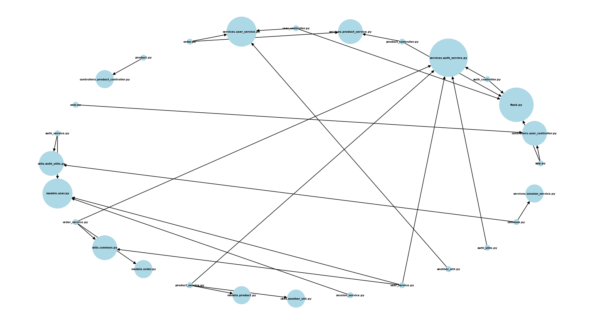

# Import-Graph-Visualizer-Python

Each edge from node A to node B implies that A is dependent on B.
Running visualiser.py will result in it taking an input of the file path of the root folder of the codebase that needs to be visualized. Entering "Loop-Labyrinth-Analysis-main" for example, will generate the following. Each node's size scales with its number of inward edges.

